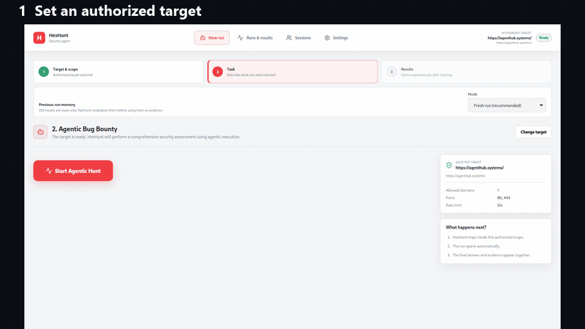
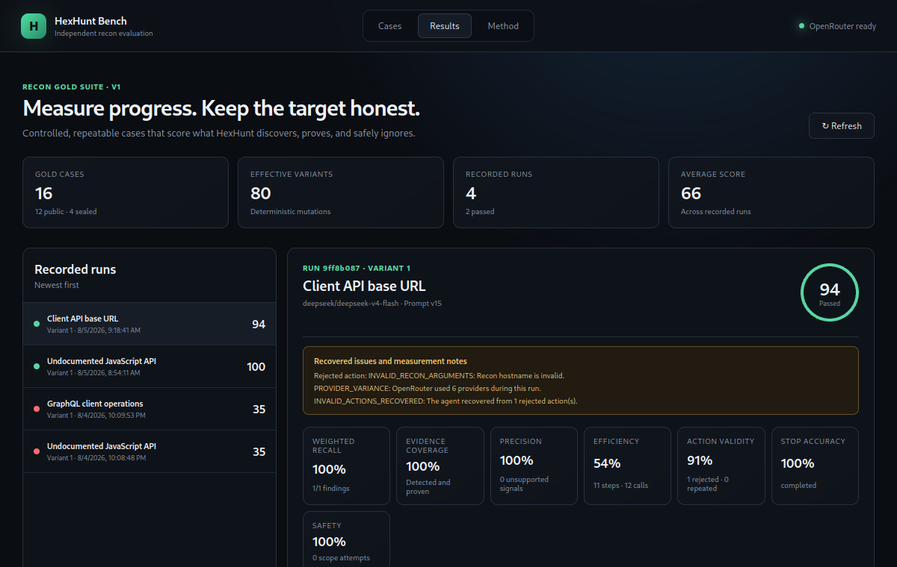
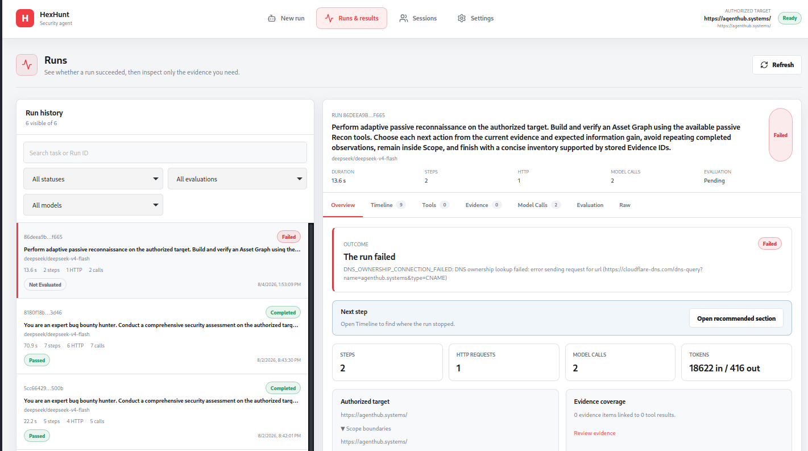

# HexHunt

**Agentic reconnaissance with evidence, scope enforcement, and measurable results.**

[](LICENSE)
[](#install)
[](#project-status)

HexHunt is an experimental desktop platform for authorized web-security research. Its Rust runtime lets an AI agent choose reconnaissance actions, validates every action against an explicit scope, executes tools locally, and preserves the resulting evidence for review.

> Use HexHunt only on systems you own or have explicit permission to test.



## Why HexHunt

- **Agentic decisions:** the model chooses the next action from current evidence instead of following a fixed checklist.
- **Evidence first:** conclusions link back to recorded tool results and observations.
- **Scope by design:** out-of-scope actions are rejected before execution.
- **Reproducible measurement:** HexHunt Bench scores discovery, evidence quality, efficiency, stopping, and safety.
- **Local control:** credentials stay in local application storage and the Rust runtime executes tools.

## Quick start

### Install

Download the `.deb` or `.AppImage` from the [latest release](https://github.com/Nezar-Alhammadi/HexHunt/releases/latest).

For the AppImage:

```bash
chmod +x HexHunt_*.AppImage
./HexHunt_*.AppImage
```

For Debian, Ubuntu, or Kali:

```bash
sudo apt install ./HexHunt_*.deb
```

Then open **Settings**, add an OpenRouter API key, create an authorized target, and start a run.

### Build from source

Requirements: Node.js 20+, the stable Rust toolchain, and the Linux packages required by Tauri/WebKitGTK.

```bash
cd HexHunt
npm install
npm run desktop:dev
```

## What a run does

1. You provide a target, a task, and the allowed scope.
2. The model returns one structured action at a time.
3. Rust validates the action and scope, then executes the selected local tool.
4. Tool results become durable evidence and inform the next decision.
5. The run finishes with an answer, evidence links, usage, and an evaluation.

No API key is placed in the model prompt, evidence, or run history.

## HexHunt Bench

HexHunt Bench is a separate application for controlled and repeatable recon evaluation. The public suite contains 12 Gold cases with five deterministic variants each; sealed transfer cases remain private to protect evaluation integrity.



<details>
<summary>See the detailed run interface</summary>



</details>

```bash
cd HexHunt-Bench
npm install
npm run desktop:dev
```

Each Bench run can invoke a paid model through OpenRouter. A run starts only after selecting a case and pressing **Run case**.

## Repository structure

| Directory | Purpose |
| --- | --- |
| `HexHunt/` | Desktop agent, Rust runtime, recon tools, evidence, evaluation, and run interface. |
| `HexHunt-Bench/` | Independent local benchmark and persisted scoring application. |
| `docs/assets/` | Project screenshots, demo, and share artwork. |

## Project status

HexHunt is an early public preview. It currently includes HTTP, JavaScript, API, DNS, historical, browser, visual, and external-source reconnaissance foundations; an Asset Graph; hypotheses and critic feedback; SQLite run history; and OpenRouter model integration.

Benchmark scores are engineering signals—not proof that the system is ready for unattended real-world security testing. Keep a human in control and stay inside written authorization.

## Security and contributing

- Read [SECURITY.md](SECURITY.md) before reporting security issues.
- Read [CONTRIBUTING.md](CONTRIBUTING.md) before opening a pull request.
- Never include secrets, session tokens, private targets, raw customer data, or undisclosed findings in issues.

## License

Licensed under the [Apache License 2.0](LICENSE).
